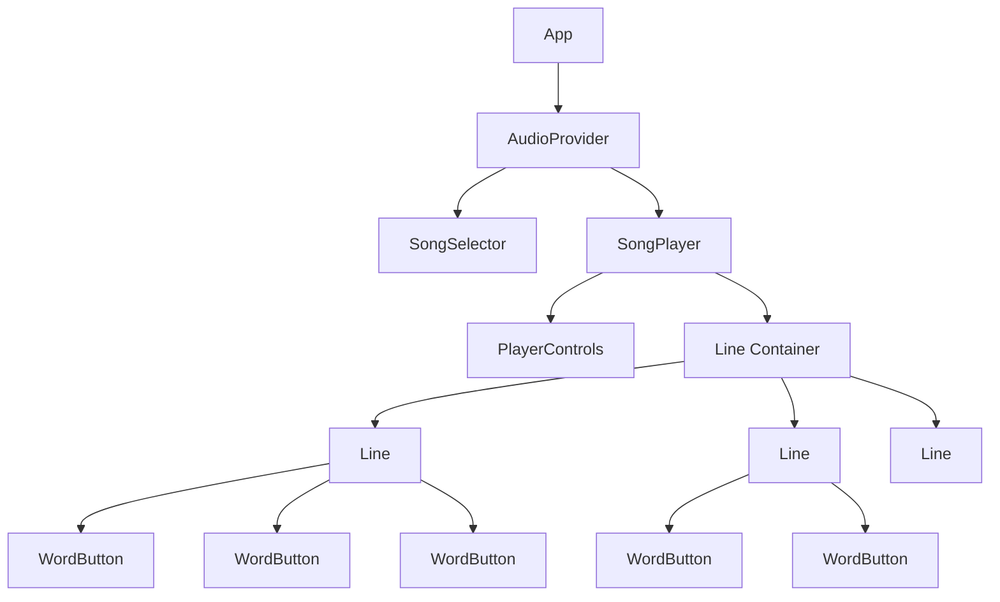

# LearnSongs Component Specifications

## Component Structure

### 1. App Component
**Purpose**: Main application wrapper
**Responsibilities**:
- Initialize audio context
- Manage global state through AudioProvider
- Route between song selection and song playback

### 2. AudioProvider Component
**Purpose**: Global audio state management
**Responsibilities**:
- Manage current song state
- Handle audio loading and preloading
- Control playback state and modes
- Provide audio context to child components

### 3. SongSelector Component
**Purpose**: Display and select songs
**Responsibilities**:
- Show list of available songs
- Display song metadata (title, difficulty, tags)
- Handle song selection
- Provide search/filter functionality

### 4. SongPlayer Component
**Purpose**: Main song playback interface
**Responsibilities**:
- Display song title and metadata
- Render lines of words
- Manage playback controls
- Handle word/line interactions

### 5. Line Component
**Purpose**: Display a line of words
**Responsibilities**:
- Render WordButton components for each word
- Handle line-level interactions
- Manage active state for words in the line

### 6. WordButton Component
**Purpose**: Interactive word display
**Purpose**: Interactive word display
**Responsibilities**:
- Display word text
- Handle click/tap events
- Show active state
- Provide visual feedback

### 7. PlayerControls Component
**Purpose**: Playback control interface
**Responsibilities**:
- Play/pause functionality
- Mode selection (word/line/song)
- Navigation controls
- Progress display

## Detailed Component Specifications

### SongSelector
```
Props:
- songs: SongConfig[]
- selectedSongId: string
- onSelectSong: (songId: string) => void

Features:
- Grid or list layout for songs
- Search/filter by tags
- Sort by title or difficulty
- Visual indicators for song metadata
- Responsive design for tablets
```

### SongPlayer
```
Props:
- song: SongConfig
- onBack: () => void

State:
- activeLineIndex: number
- activeWordIndex: number
- isPlaying: boolean
- playMode: 'word' | 'line' | 'song'

Features:
- Back navigation
- Song title display
- Metadata display
- Progress bar
- Responsive line/word layout
```

### Line
```
Props:
- words: Word[]
- activeWordId: string | undefined
- onWordClick: (wordId: string) => void
- lineNumber: number

Features:
- Horizontal layout of words
- Line-specific styling
- Active word highlighting
- Touch-friendly sizing
```

### WordButton
```
Props:
- word: Word
- isActive: boolean
- onClick: () => void

Features:
- Minimum 100x50px touch target
- Visual feedback on interaction
- Active state highlighting
- Accessible labeling
- Responsive sizing
```

### PlayerControls
```
Props:
- isPlaying: boolean
- playMode: 'word' | 'line' | 'song'
- onPlay: () => void
- onPause: () => void
- onModeChange: (mode: 'word' | 'line' | 'song') => void
- onPrevious: () => void
- onNext: () => void

Features:
- Play/pause button
- Mode selection
- Navigation buttons
- Progress indicator
- Large touch targets
```

## Component Hierarchy Diagram



## State Management Flow

### Audio Loading Sequence
1. User selects song
2. AudioProvider triggers preloading
3. useAudioPreloader loads all audio files
4. Audio buffers stored in context
5. SongPlayer renders with loaded audio

### Playback Sequence (Word Mode)
1. User clicks WordButton
2. onClick handler calls audio play function
3. useAudio plays word audio
4. UI updates to show active word
5. Audio completes, active state cleared

### Playback Sequence (Line Mode)
1. User clicks any word in line
2. Line component triggers line playback
3. useAudio plays all words in sequence
4. UI updates to show active word progression
5. Line completes, active state cleared

### Playback Sequence (Song Mode)
1. User clicks play button
2. PlayerControls triggers song playback
3. useAudio plays words in sequence through all lines
4. UI updates to show active word/line progression
5. Song completes, playback stops

## Accessibility Implementation

### Keyboard Navigation
- Tab order follows visual layout
- Enter/space activates current element
- Arrow keys navigate between words in line
- Escape returns to song selection

### Screen Reader Support
- ARIA labels for all interactive elements
- Live regions for playback status
- Semantic HTML structure
- Proper heading hierarchy

### Focus Management
- Visible focus indicators
- Focus maintained during state changes
- Skip links for efficient navigation
- Focus trapping in modal dialogs

## Mobile/Tablet Optimizations

### Touch Interface
- Minimum 44px touch targets
- Adequate spacing between elements
- Immediate visual feedback
- No hover-only interactions

### Performance
- Efficient re-rendering with React.memo
- Virtualized lists for large song collections
- Audio buffer caching
- Lazy loading of non-critical resources

### Responsive Design
- Flexible layouts using CSS Grid/Flexbox
- Media queries for different screen sizes
- Adjustable font sizes
- Orientation change handling